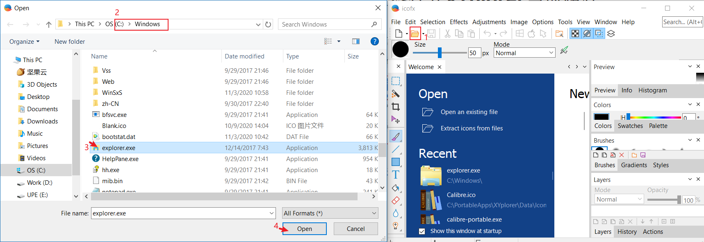

在介绍过程中，所有技巧均按XYplorer英文版进行说明，中文版的用户请自行对照。

# 20191011 

# 使用过程中出现崩溃的原因和解决方法


出现崩溃现象效果如下图


会出现一个Coffee的俯视图。

原因就两种，具体看图片红字描述。


减少或避免出现崩溃的方法

* 选中非最后一个标签页，然后新建标签页
* 尽量少用`设置(Configuration(F9))`按钮，如果要用，记得在File -> Save Setting，否则会丢失本次打开的使用记录。

# 20200311

# 在XYplorer中使用QuickLook

[QuickLook](https://github.com/QL-Win/QuickLook)  [(此处下载)](https://github.com/QL-Win/QuickLook/releases)

-具体方法如下，

1.在`你的XYplorer目录\Data\Scripts`下在创建一个`.xys`脚本文件，命名为`Run QuickLook.xys`，内容如下

```
run "你的QuickLook目录\QuickLook.exe" "<curitem>";
```

2.然后，按下图完成设置，


我这里分配的按键<kbd>Alt+1</kbd>

Script File内容如下

```
<xyscripts>\Run QuickLook.xys
```

3.最后，请关闭语法检查，具体方法如下，


若未关闭语法检查，使用QuickLook配合快捷键会出现这样的错误，


4.方法介绍完了，使用时，先选中要预览的文件，然后<kbd>Alt+1</kbd>即可。

-说明事项：

XYplorer中使用QuickLook，是否可以使用空格键？

答：QuickLook在XYplorer使用中，不能使用<kbd>Spacebar</kbd>，因为它是被XYplorer保留[[?](https://www.xyplorer.com/xyfc/viewtopic.php?t=20326)]，因而你无法在XYplorer中使用它。

参考：https://github.com/QL-Win/QuickLook/issues/96


# 使用Windows文件管理器打开XYplorer当前路径

-使用效果如下，

-具体方法如下，

1.提取图标。提取工具[IcoFX3(下载地址若失效，自行下载)](https://ghpym.lanzous.com/b00zelckd)[可选]




2.添加按钮


内容信息如下

``` 
Explorer
<xyicons>\Explorer.ico
run "C:\Windows\explorer.exe" <curpath>
```

-END

-XYplorer小知识

设当前XYplorer目录位于<code>C:\PortableApps\XYplorer</code>;设当前目录位于<code>F:\PictureLib</code>

目录结构：

```
C:\PortableApps\XYplorer>tree
Folder PATH listing for volume OS
Volume serial number is 080B-2E29
C:.
└─Data
    ├─AutoBackup
    ├─Catalogs
    ├─FindTemplates
    ├─Icons
    ├─NewItems
    │  └─New folder
    ├─Panes
    │  ├─1
    │  │  └─t
    │  └─2
    │      └─t
    ├─Paper
    ├─Scripts
    │  └─Everything
    ├─Temp
    └─Thumbnails
```


在地址栏分别输入<code>::msg <xypath></code>、<code>::msg <xydata></code>、<code>::msg <xyicons></code>、<code>::msg <xyscripts></code>、<code>::msg <xypaper></code>、<code>::msg <xycatalogs></code>、<code>::msg <xynewitems></code>、、<code>::msg <curpath></code>，结论如下，

```
<xypath> = C:\PortableApps\XYplorer
<xydata> = C:\PortableApps\XYplorer\Data
<xyicons> = C:\PortableApps\XYplorer\Data\Icons
<xyscripts> = C:\PortableApps\XYplorer\Data\Scripts
<xypaper> = C:\PortableApps\XYplorer\Data\Paper
<xycatalogs> = C:\PortableApps\XYplorer\Data\Catalogs
<xynewitems> = C:\PortableApps\XYplorer\Data\NewItems
<curpath> = F:\PictureLib
```

<code>::msg <curname></code>的输出需要选中一个文件，比如鼠标选中<code>F:\PictureLib\a.png</code>，那么输出

```
F:\PictureLib\a.png
```

什么都不选中，则输出空白（即什么都没有）。

