# 事先说明

在介绍过程中，所有技巧均按**XYplorer英文版**进行说明，中文版的用户请自行对照。因为*许多参考和官网文档都是英文的*，我翻译过来还要用中文来写每个界面的按钮，太麻烦了也不利于深度使用。

第一，本文阅读最好连同Updates目录一起下载到本地，使用Typora进行阅读，阅读时打开“大纲”功能，**选择你需要的章节阅读**。

友情提示：下载速度慢的可以去下载一个Tampermonkey插件——[Github 增强 - 高速下载](https://greasyfork.org/en/scripts/412245-github-%E5%A2%9E%E5%BC%BA-%E9%AB%98%E9%80%9F%E4%B8%8B%E8%BD%BD)，安装后不管是clone还是下载zip都可以选择分流节点。


第二，更新频率和内容。不定期更新，也可能不更新。同时更新的内容大多都是个人长期使用过程中遇到的问题和需求。

第三，解惑。可以Google或者参考官方帮助文档，按<kbd>F1</kbd>呼出，若无法呼出，请下载`XYplorer.chm`。

第四，本文参考来源主要包括Google搜索、XYplorer Beta Club、官网帮助文档。

有时，为了书写方便，我会把XYplorer简称为XY。

第五，所有的图片都保存在Image文件夹，不上载到图传是因为鬼知道哪天图片服务器和存储器会不会突然坏掉。

# <em>20191011 </em>

# 使用过程中出现崩溃的原因和解决方法

出现崩溃现象效果如下图


会出现一个Coffee的俯视图。

原因就两种，具体看图片红字描述。


减少或避免出现崩溃的方法

* 选中非最后一个标签页，然后新建标签页
* 尽量少用`设置(Configuration(F9))`按钮，如果要用，记得在File -> Save Setting，否则会丢失本次打开的使用记录。


# <em>20200311 ~ Now</em>

# <span id="scripts">关于Scripts的一些事</span>

XY使用`Visual Basic 6`开发的，并且编译为本地代码(Native code)，以获取更快的运行速度[[?](https://www.xyplorer.com/xyfc/viewtopic.php?t=6350)]。

`XYplorer Script`用什么程序语言写成的，我们不得而知，不过Script借用了许多来自php特性(比如字符串的连接可以<code>.</code>来完成)。就像我们学习新的语言一样，它应该有规则和例子供beginner来学习。

具体用法和示例在`XYplorer.chm->Content选项卡->Advanced Topics`中的<span style="color:red">**Scripting**</span>和<span style="color:red">**Scripting Commands**</span>的部分。如何寻找这部分呢？在XYplorer菜单栏`Help->Cotents and Index(F1)`中，其中<kbd>F1</kbd>调用的是XYplorer目录下的`XYplorer.chm`(若无，可以在本GitHub Page中下载)，或者`Help->Help on Scripting Commands`切出帮助文档。

下面是`XYplorer Native  Variables`的部分实例：

设当前XY目录位于<code>C:\PortableApps\XYplorer</code>;设当前目录位于<code>F:\PictureLib</code>

目录结构如下，

```
C:\PortableApps\XYplorer>tree
Folder PATH listing for volume OS
Volume serial number is 080B-2E29
C:.
└─Data
    ├─AutoBackup
    ├─Catalogs
    ├─FindTemplates
    ├─Icons
    ├─NewItems
    │  └─New folder
    ├─Panes
    │  ├─1
    │  │  └─t
    │  └─2
    │      └─t
    ├─Paper
    ├─Scripts
    │  └─Everything
    ├─Temp
    └─Thumbnails
```

在地址栏分别输入<code>::msg \<xypath\></code>、<code>::msg \<xydata\></code>、<code>::msg \<xyicons\></code>、<code>::msg \<xyscripts\></code>、<code>::msg \<xypaper\></code>、<code>::msg \<xycatalogs\></code>、<code>::msg \<xynewitems\></code>、、<code>::msg \<curpath\></code>，结论如下，

```
<xypath> = C:\PortableApps\XYplorer
<xydata> = C:\PortableApps\XYplorer\Data
<xyicons> = C:\PortableApps\XYplorer\Data\Icons
<xyscripts> = C:\PortableApps\XYplorer\Data\Scripts
<xypaper> = C:\PortableApps\XYplorer\Data\Paper
<xycatalogs> = C:\PortableApps\XYplorer\Data\Catalogs
<xynewitems> = C:\PortableApps\XYplorer\Data\NewItems
<curpath> = F:\PictureLib
```

<code>::msg \<curname\></code>的输出需要选中一个文件，比如鼠标选中<code>F:\PictureLib\a.png</code>，那么输出

```
F:\PictureLib\a.png
```

什么都不选中，则输出空白（即什么都没有）。

更多XYplorer Native  Variables介绍，请参考`XYplorer.chm->左上方Inbox->输入XYplorer Native  Variables`。

---


# 文件夹图标 | File Icons


File Icons的配置在`XYplorer.ini`中：以下内容就摘自此文件

```ini
[FileIcons]
Count=17
1=+readme.*>Papirus-Team-Papirus-Mimetypes-Text-x-readme.ico
2={:Image}>Papirus-Team-Papirus-Mimetypes-Image-x-generic.ico
3=+xys>Papirus-Team-Papirus-Mimetypes-Text-x-script.ico
4=+sql>Papirus-Team-Papirus-Mimetypes-App-x-sqlite-2.ico
5=+h>Papirus-Team-Papirus-Mimetypes-Text-x-chdr.ico
6=+readme.txt>Papirus-Team-Papirus-Mimetypes-Text-x-readme.ico
7=+c>Papirus-Team-Papirus-Mimetypes-Text-x-csrc.ico
8=+txt>Note Pad.ico
9=+md>Text Editor Typora.ico
10=+hex>Papirus-Team-Papirus-Mimetypes-Text-x-hex.ico
11=py>Python.ico
12=+java>Papirus-Team-Papirus-Mimetypes-Text-x-java.ico
13=+log>Papirus-Team-Papirus-Mimetypes-Text-x-log.ico
14=+cpp>Papirus-Team-Papirus-Mimetypes-Text-x-c-plus-plus-src.ico
15=+css>Papirus-Team-Papirus-Mimetypes-Text-css.ico
16=+py>Papirus-Team-Papirus-Mimetypes-Text-x-python.ico
17=+makefile>Papirus-Team-Papirus-Mimetypes-Text-x-makefile.ico
```

效果大概就是这样子的：


使用基本语法：

```x
匹配规则>图标路径
```

比如，

```
txt;ini;xml>xxx.ico //图标位于<xyicons>/xxx.ico。匹配文件格式是.txt, .ini, .xml
```

从帮助文档(F1)摘出来的：

```
%computer%    matches the Computer special folder
%desktop%     matches the Desktop special folder
%personal%    matches the Personal special folder
%user%        matches the User special folder
%net%         matches the Network special folder
%recycler%    matches the Recycle Bin special folder
E:\           matches drive E:\
E:\*\         matches all folders in E:\
E:\ /r        matches all folders in E:\ and E: itself
E:\Jobs\*\    matches all folders in E:\Jobs\
[F-L]:\*\     matches all folders on drives F-L
*\            matches all folders that have no specific icon
**\           same as above for the current tree folder
pics\         matches all folders named "pics"
E:\*          matches all files in E:\
pics\*        matches all files in folders named "pics"
pics*\*       matches all files in folders beginning with "pics"
*.jpg;*.png   matches all JPG and PNG files
*.fnd         matches all FND files and is used for Search Results
*.            matches all files with no extension 
*?            matches all files of unknown file type
*23*          matches all files containing "23" in the name
*2013*.txt    matches all TXT files containing "2013" in the name
readme.txt    matches all files named "readme.txt"
<xyicons>\*   matches all files in the default Icons folder
\\Wagner\     matches server "Wagner"
```

问：我的文件夹都已经自定义图标了，这个`File Icons`设置的图标会不会覆盖Window设置的图标呢？

答：符合条件的File Icons会替换Windows设置的图标的。不过可以加下参数保留Windows设置的图标。

在帮助文档中已经给出了答案：


# 如何找出需要的命令?

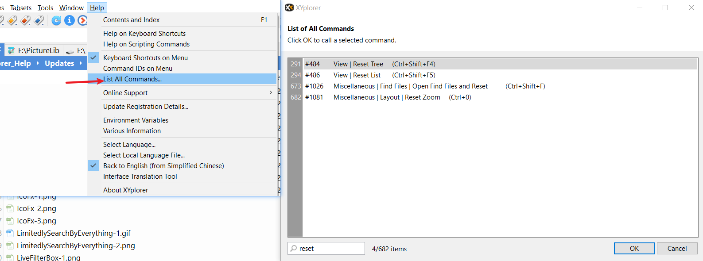


# 按钮和用户自定义命令区别

工具栏上的都是按钮，这些按钮中，用户自定义的按钮(`User Button`)都是没办法分配快捷键的。

如果需要使用快捷键关联什么操作，那就需要使用用户自定义命令(User-Defined Commands)。

> Buttons are meant for the mouse. UDCs are meant for the keys.[[?](https://www.xyplorer.com/xyfc/viewtopic.php?t=14505)]


# 工具栏的使用 | Toolbar

## 工具栏的摆放和使用

一个合理的工具栏按钮摆放，可以提高使用效率。这是我的工具栏按钮摆放(2020/11/10)：


我的电脑 | 前、后退、上一级、撤销等 | 收藏、添加Tags | 文件属性、打开方式、是否显示系统文件，隐藏文件 |  Visual过滤 | Pane | Color过滤器 | 设置 夜间模式 | View功能 | 用户按钮


## <span id="further_use_of_button">按钮的高级用法</span>

### <span id="explorer_button">[案例1]使用Windows文件管理器打开XYplorer当前路径</span>

-使用效果如下，

-具体方法如下，

1.提取图标。提取工具[IcoFX3(下载地址若失效，自行下载)](https://ghpym.lanzous.com/b00zelckd)[可选]


2.添加按钮


内容信息如下

``` 
Explorer
<xyicons>\Explorer.ico
run "C:\Windows\explorer.exe" <curpath>
```

这个脚本不完善，仅限打开当前目录。需要功能更全的Explorer脚本，可以使用[设置快捷键调用Explorer](#explorer_ks)的脚本。

`<xyicons>`介绍请参考[关于Scripts的一些事](#scripts)

-END


### [案例2]CMD集成到按钮

XY官网已经把**Cmd的按钮集成到工具栏了**，并且提供了热键<kbd>Ctrl + Alt + P</kbd>。

你现在可以在自定义工具栏中的列表中找到它，

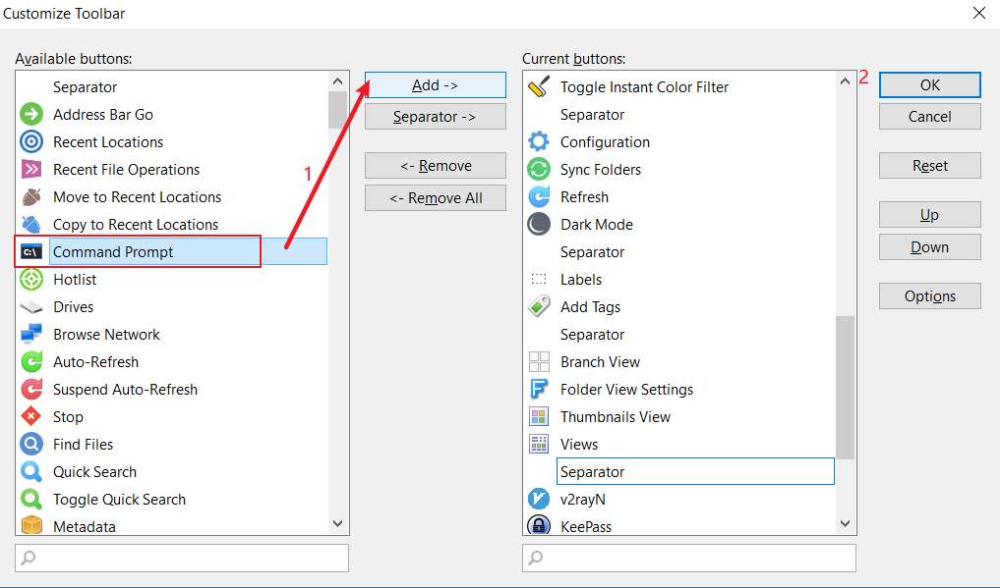

不过下面我还是给出用户自定义Cmd按钮的方法。


按钮信息如下，

```
Cmd as Admin
<xyicons>\Cmd.ico

$comspec = ("%osbitness%" == 64) ? "%windir%\System32\cmd.exe" : "%windir%\SysWOW64\cmd.exe";
    $cscript = ("%osbitness%" == 64) ? "%windir%\System32\cscript.exe" : "%windir%\SysWOW64\cscript.exe";

    $vbsFile = "%TEMP%\~OpenElevatedCMD.vbs";

    $vbsContent = <<<>>>
        Set UAC = CreateObject("Shell.Application")
        UAC.ShellExecute "$comspec", "/k pushd ""<curpath>""", "", "runas", 1
>>>;

    writefile($vbsFile, trim($vbsContent));

    if (get("trigger") == "1") { // Left click -> Admin
        run """$cscript"" ""$vbsFile"" //nologo", , 0, 0;
    } elseif (get("trigger") == "2") { // Right click -> No admin
        run """$comspec"" /k pushd ""<curpath>""";
    }
```

按钮的添加方法在“按钮的高级用法”[[?](#further_use_of_button)]部分有讲到。

使用评价：

这个cmd其实也不是很好用，也没有快捷键可以调用按钮，再加上XY官网已经集成了Cmd按钮。下面还是会给出一些替代方案。

Alternative Solution 1(比较笨(～￣(OO)￣)ブ):  偶尔我还是会<kbd>Win + R</kbd>来启动cmd，进入cmd，切换盘符（比如<code>f:</code><kbd>Enter</kbd>)，然后在XYplorer某个目录下<kbd>Alt + D</kbd> <kbd>Ctrl + C</kbd>复制路径回到cmd粘贴。

Alternative Solution 2(我未测试过): 你也可以先把cmd集成到Windows右键的Context中，然后[将windows右键菜单添加到XYplorer](https://zhuanlan.zhihu.com/p/70331585)，XYplorer中使用Windows右键ContextMenu调用cmd。我不想折腾了，要命了。

Alternative Solution 3(推荐): 你完全可以使用XYplorer集成的Windows文件管理器按钮打开Explorer.exe[[?](#explorer_button)]，使用Windows自带的文件管理器空白处右键运行cmd[[?](https://www.cnblogs.com/dream4567/p/10693588.html)]。


---

# 用户自定义命令的使用 | User-Defined Commands

## 设置快捷键调用Notepad

创建`OpenWithNotepad.xys`存放在XYplorer/Data/Scripts目录下，内容如下，

```
	if (<curitem> != "" && filetype(<curitem>) != "Nofile") {
		run notepad "<curitem>";
	}
```

添加命令方法：`User->Manage Commands...->Category:Load Script File->New-Add New Command`填写Caption和Script File

`Assign Keyboard Shortcut... `，我设置的<kbd>Alt + 3</kbd>。


```
Caption:Open With Notepad
Scripts Files:<xyscripts>\OpenWithNotepad.xys
```

使用方法：选中文件，<kbd>Alt + 3</kbd>速度调用`notepad`打开文本。

## <span id="explorer_ks">设置快捷键调用Explorer</span>

设置方法同上，创建`OpenWithExplorer`存放在XYplorer/Data/Scripts目录下，内容如下，

```
	if (<curitem> == "") {
		run "C:\Windows\explorer.exe" <curpath>
	} else {
		if (filetype(<curitem>) == "Nofile") {	//选中的是目录
		run "C:\Windows\explorer.exe" <curitem>
	}
		else {	
			run "C:\Windows\explorer.exe" <curpath>
		}
	}
```

我分配的快捷键是<kbd>Ctrl + Alt + E</kbd>

```
Caption:Open With Explorer
Scripts Files:<xyscripts>\OpenWithExplorer.xys
```


## 在XYplorer中使用QuickLook

[QuickLook](https://github.com/QL-Win/QuickLook)  [(此处下载)](https://github.com/QL-Win/QuickLook/releases)

-具体方法如下，

1.在`你的XYplorer目录\Data\Scripts`下在创建一个`.xys`脚本文件，命名为`Run QuickLook.xys`，内容如下

```
run "你的QuickLook目录\QuickLook.exe" "<curitem>";
```

2.然后，按下图完成设置，


我这里分配的按键<kbd>Alt+1</kbd>

Script File内容如下

```
<xyscripts>\Run QuickLook.xys
```

3.最后，请关闭语法检查，具体方法如下，

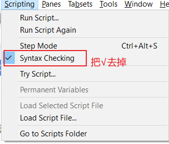

若未关闭语法检查，使用QuickLook配合快捷键会出现这样的错误，


4.方法介绍完了，使用时，先选中要预览的文件，然后<kbd>Alt+1</kbd>即可。

-说明事项：

XYplorer中使用QuickLook，是否可以使用空格键？

答：QuickLook在XYplorer使用中，不能使用<kbd>Spacebar</kbd>，因为它是被XYplorer保留[[?](https://www.xyplorer.com/xyfc/viewtopic.php?t=20326)]，因而你无法在XYplorer中使用它。

参考：https://github.com/QL-Win/QuickLook/issues/96


# 导航面板目录的使用 | Navigation Panels - Catalog

## 打开侧边栏

F8->Ctrl+F8即可打开。

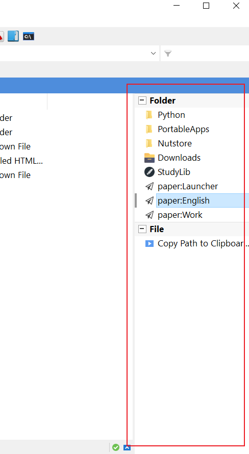

## 添加目录

Catalog栏是空白的，需要右键`Add New Category...`


自定义名称

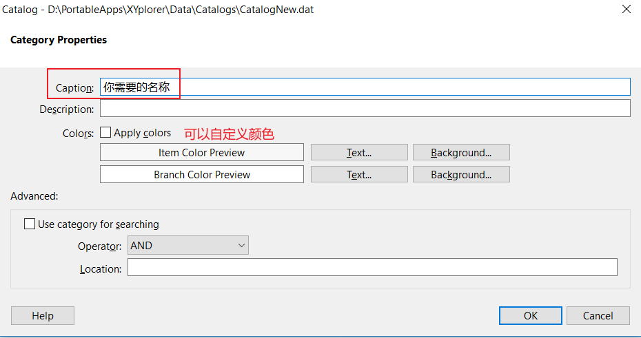

确认右边栏就会变成这样

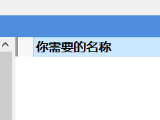

## 添加项目

### 拖动式添加项目

如果你需要添加文件到目录上，那么就把文件拖到“你需要的名称”上。

比如我把一张图片(Catalog-4.png)拖到目录名上，就会出现如下内容，


### 自定义式添加项目

#### 添加脚本

**选中目录名称**，然后右键`Add New Item Here...`(快捷键式<kbd>Insert</kbd>)，可以自定义你要添加的项目。比如刚刚添加的.png文件就是一个项目(Item)。

若我想要添加一个脚本呢？

以下脚本的功能是选中一个文件，然后鼠标左键轻点一下就会复制文件的路径，不过这个文件的路径是以正斜杆`/`分割路径部分的。比如，`D:/Work/GitWorks/XYplorer_Help/Updates/Image/Catalog-5.png`，而不是`D:\Work\GitWorks\XYplorer_Help\Updates\Image\Catalog-5.png`。这么做是为了避免要在字符串中转义反斜杠`\`。

脚本内容如下，

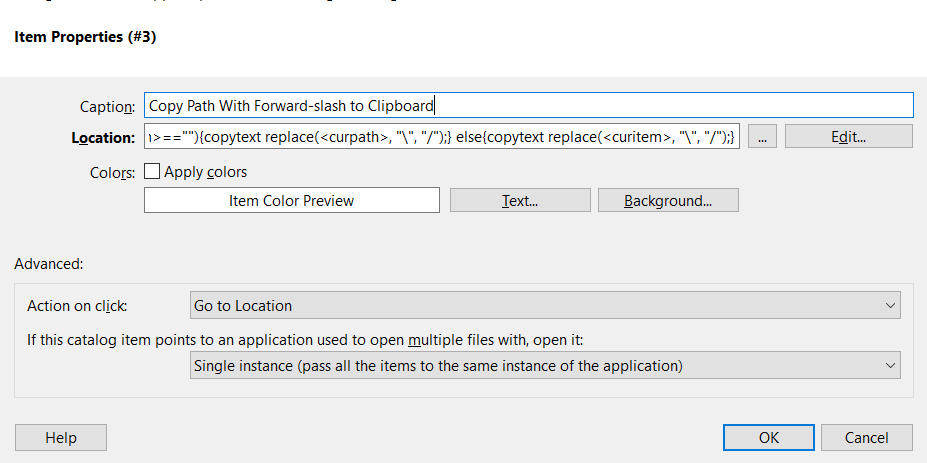

Caption: `Copy Path With Forward-slash to Clipboard `

Location:

```
::if(<curitem>==""){copytext replace(<curpath>, "\", "/");} else{copytext replace(<curitem>, "\", "/");}
```

#### 添加纸文件夹

-先创建纸文件夹

从地址栏输入<code><xypaper></code>，回车进入纸文件夹XYplorer\Data\Paper。

创建纸文件夹，纸文件夹以.txt结尾。我这里创建名为Test.txt。

-添加纸文件夹到目录

打开纸文件夹的语法格式:`paper:纸文件夹名`

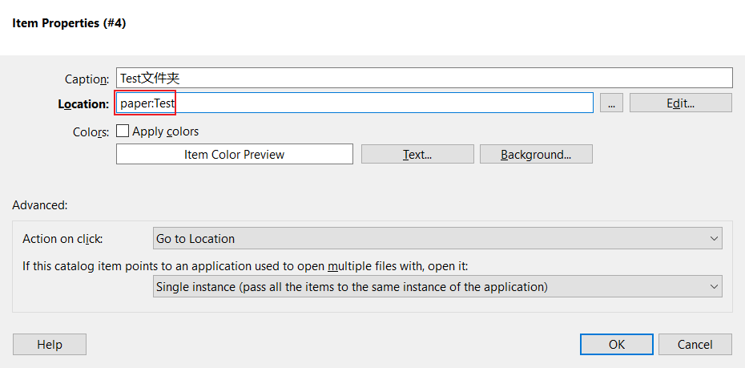


-添加项目到纸文件夹

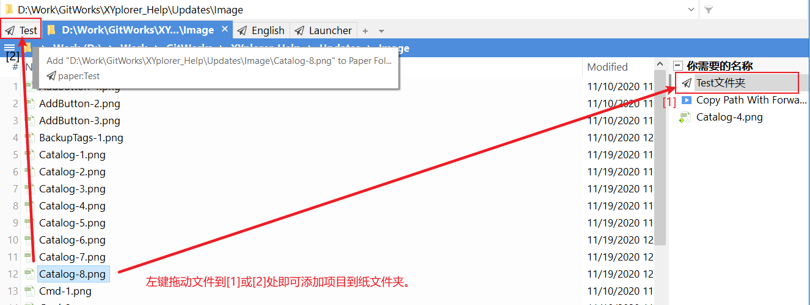


-请尽情探索纸文件夹

如果你打开\<xypaper\>/Test.txt，可以发现多处一行内容：

```
D:\Work\GitWorks\XYplorer_Help\Updates\Image\Catalog-8.png
```

纸文件夹不仅可以保存文件，还可以保存文件夹，纸文件夹主要用于存放同一个主题的素材。

## 目录数据的保存

-定位当前目录的数据文件


-数据文件保存位置

地址栏输入<code><xycatalogs></code>回车即可看到目录数据文件。丢失数据文件，那么目录栏就是空白的了，请保存好。


# 树的使用 | Tree

树的配置主要在`View`、`Tools->Customize Tree`、`Configuration(F9)->Tree and List`，少部分可以通过键入关键字"Tree"到`Configuration(F9)->左下角Jump to Setting`进行寻找、

菜单栏`Windows->Show Tree(Shift + F8)`，打开Tree记录功能。

`View->Mini Tree`：只显示选项卡(Tab)的路径的树，由于不需要显示无关目录的树，所以速度更快。

由于Tree会记录文件浏览历史，在退出XYplorer前，`View->Reset Tree(Ctrl + Shift + F4)`，如果路径历史过多，影响加载速度。

在Tree开启的情况下，每一次浏览目录，侧边的Tree都会追踪记录，所以你可以很容易看到当前目录和历史目录的层次结构。

`Tools->Customize Tree->Tree Path Tracking`：开启树追踪标记


`View->Lock Tree`：开启后，记住（冻结为）上一次树结构的状态，接下来无论怎样浏览目录，树的追踪记录都看不到。开启期间，应该是不会有目录追踪记录的。当关闭后，恢复树的追踪记录功能，并更新为当前目录的树结构。使用建议：需要树功能，XYplorer运行卡的情况下可锁定。

我的使用方法：关闭Mini Tree，Reset Tree，Lock Tree。把Tree的侧边栏空间压缩，只保留很小的地方，如图


之所以这样做，是因为我需要快速浏览C/D/E/F，对显示树结构的目录需求不是很大，并且在Tree侧边栏**右键**可以弹出**收藏夹列表**。

如果你需要使用树的功能，请一定要把XYplorer界面左右两侧拉长，如果不拉长，使用起来很没有体验。两侧拉长还有一个重要的理由：但你的文件夹视图是“详情视图”时，每一个文件的描述列：文件名、修改时间、创建时间、后缀名、文件夹大小等，想要把这些列的信息全，那么你就必须拉长。


# XYplorer的搜索问题及最佳搜索替换工具Everything | Search

## XYplorer的搜索

-XYplorer的搜索体现在四处

1.`Edit->Find Files(Ctrl +F)`

需要指定搜索目录，关键字。其他过滤条件可选。但搜索速度慢。

2.`Edit->Quick Search(F3)`

没什么用

3.Live Filter Box。

使用方式：`Window->Show Live Filter Box`。在地址栏最右侧可以看到，如图


<kbd>Ctrl + Alt + X</kbd>进入，搜索关键字。

该功能用于当前目录下筛选文件（极其适合目录文件过量的情况下进行筛选）

假设我们需要筛选出<code>C:\Windows\SysWOW64\certcli.dll</code>，你只知道关键字"cert"，在Live Filter Box键入"cert"后，


这是一次模拟筛选，该功能场景范围过窄但好用。

4.在当前目录输入目标文件的关键字母，可以快速选中匹配文件（Windows也有）

## Everything内容打开到XYplorer侧

`Options->General->Context Menu`，如图


Explore:

```
$exec("你的XYplorer目录\XYplorer.exe" "%1")
```

Explore Path:

```
$exec("你的XYplorer目录\XYplorer.exe" /select="%1")
```


Explore和Explorer Path的区别：前者打开这个文件；后者打开这个文件所在的父目录。

参考：[Everything and XYplorer - My Everything Integration Settings - XYplorer Beta Club](https://www.xyplorer.com/xyfc/viewtopic.php?t=20506)

这里有个以前用过目前弃用的Scripts的链接：[Everything for xyplorer - XYplorer Beta Club](https://www.xyplorer.com/xyfc/viewtopic.php?f=7&t=21480)。如果你感兴趣，可以尝试一下。

当然，纠结Scripts文件来调用`Everything's command-line ES`服务来搜索是没有必要的，复杂麻烦而且没直接使用Everything来得快。你可以跟我一样，添加一个Everything按钮，或者设置一个热键调用XY（请参考[XYplorer间接调用Everything](#invoke_everything)）。

## <span id="invoke_everything">XYplorer间接调用Everything</span>

仅在当前目录下搜索（搜索的目标包括当前目录和当前目录的所有子目录)，示意图如下，


具体显示步骤如下，

1.创建脚本文件。菜单栏`Scripting->Go to Scripts Folder`来到\<xyscripts\>的目录下，创建名为`EverythingCurpathSearch.xys`脚本文件，内容如下，记得修改everything目录

版本一[可选，推荐]

```
	$everything = "D:\PortableApps\Everything\everything.exe";		//填写everything.exe路径
	runret ("cmd /c ".$everything." -path "."""<curpath>""");
```

以上每行语句都有一个<kbd>Tab</kbd>哦。

版本二[可选]

版本二特别注意：<span style="color:red">**搜索的关键词首尾不能分别带有"。也就是没办法进行准确搜索**</span>。比如`"Common Files"`

```
	$everything = "D:\PortableApps\Everything\everything.exe";		//填写everything.exe路径
	$args = input("当前文件下搜索,请输入关键词:");
	runret ("cmd /c ".$everything." -path "."""<curpath>"""." -s "."""$args""");
```

2.绑定热键。菜单栏`User->Manage Commands...(Ctril + Alt + F9)`

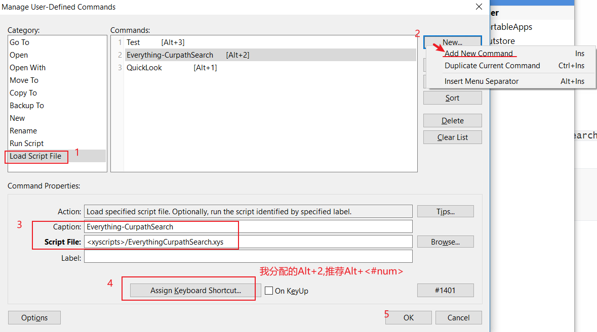

```
Cpation:CurpathSearch
Script Files:<xyscripts>/EverythingCurpathSearch.xys
```

这样就设置完成了。开始使用吧，在XYplorer当前Tab所在当前目录下按<kbd>Alt+2</kbd>，键入你想要搜索的key words，然后<kbd>Enter</kbd>即可。

Script编写思路：通过命令行调用everything，everything想要完成当前目录搜索，需要知道主程序的外部接口[[?](https://www.voidtools.com/support/everything/command_line_options/)]，需要获取当前目录和用户键入值。

Script中runret()可参考`XYplorer.chm`


编写的脚本很简陋，其目的主要是为了打开Everything，并自动化地添加上当前目录。

如果有兴趣的同学们可以自行研究下XYplorer Script(See [关于Scripts的一些事](#scripts))，熟悉流程控制语句和常用的Script Command就可以进行更高逻辑的功能实现了。

# XYplorer的备份和还原 | Backup & Restore Configuration

说到这个问题，我们先得了解下XYplorer的目录结构。

注："XYplorer的目录结构"部分费时费精力，但可以了解你经常使用功能的对应数据文件的作用。当然你也可跳到[备份什么文件才能保证数据不丢失并且换了新版也还继续用?](#backup)进行阅读。

## 文件夹结构 | Folder Hierarchy

-文件夹结构(Folder Structure)[可选读,可跳过]

以下给出的是Portable版(便携版)的目录结构，

```
D:\PortableApps\XYplorer\Data>DIR
 Volume in drive D is Work
 Volume Serial Number is 2CC0-7192

 Directory of D:\PortableApps\XYplorer\Data

11/05/2020  16:48    <DIR>          .
11/05/2020  16:48    <DIR>          ..
11/05/2020  16:35           146,086 action.dat
11/05/2020  16:31    <DIR>          AutoBackup
11/05/2020  16:31    <DIR>          Catalogs
04/10/2019  10:28           858,784 ChineseSimplified.lng
11/05/2020  16:20    <DIR>          FindTemplates
11/05/2020  16:35             2,758 fvs.dat
11/05/2020  16:31    <DIR>          Icons
11/05/2020  16:35             8,224 ks.dat
11/05/2020  16:31                26 Language.ini
11/05/2020  16:35                18 lastini.dat
11/05/2020  16:31    <DIR>          NewItems
11/05/2020  16:31    <DIR>          Panes
11/05/2020  16:31    <DIR>          Paper
11/05/2020  16:31    <DIR>          Scripts
11/05/2020  16:35               980 tag.dat
11/05/2020  16:20    <DIR>          Temp
11/05/2020  16:35               552 udc.dat
11/05/2020  16:35           129,166 XYplorer.ini
               9 File(s)      1,146,594 bytes
              11 Dir(s)  271,924,928,512 bytes free
```

XYplorer/Data目录下文件信息介绍，

```
action.dat	//撤销或重做历史记录
ChineseSimplified.lng	//中文语言文件
fvs.dat	//fvs:folder view settings. 该.dat保存文件夹视图设置信息
ks.dat	//ks:keyboard shortcuts. 该.dat保存键盘快捷键设置信息
Language.ini	//XYplorer读取并根据该配置文件信息决定选择使用哪个语言作为界面交互语言。
lastini.dat	//如果存在,则该.dat用于决定让XYplorer载入哪个.ini信息，该.dat保存的值为XYplorer,那么XYplorer就会载入XYplorer.ini
tag.dat	//该.dat保存标注(tags)信息,这个标注信息应该包括标签(Label),注释(Comment),标签(tag)信息。
udc.dat	//udc:user-defined commands. 该.dat保存用户自定义命令信息
XYplorer.ini	//保存配置信息，该配置文件不可随意覆盖，XYplorer会调用它，如果随便覆盖它可能会出现版本使用到期。
```

XYplorer/Data目录下文件夹信息介绍，

```
AutoBackup	/*开启自动备份设置后，里面会保存catalog,fvs,tag,udc的dat文件,但不保存ks.dat,还会保存XYplorer.ini.该文件这些数据信息文件会在触发"Saving Settings"进行更新。该目录的文件可迁移到全新的XYplorer时,但记得把ks.dat也复制到新的XYplore/Data下*/
Catalogs	//存放catalog.dat
FindTemplates	//参考下面英语介绍
Icons		//<xyicons>表示的目录就是Icons目录,用户可以把Xyplorer需要用到的icon保存在这里
NewItems	//XYplorer空白处右键New->New Item的内容
Paper		//纸文件夹保存目录,保存的文件以.txt形式保存
Scripts		//<xyscripts>所指向的目录就是此目录
Panes		//保存tabsets信息
Temp		//保存XYplorer运行时会用到的临时文件
```

以下为XYplorer Beta Club论坛查找到的文件夹结构[[?](https://www.xyplorer.com/xyfc/viewtopic.php?t=15133)]，

```
Catalogs        catalogs
FindTemplates   search templates (saved searches)
Fresh           skip this, this is a temporary profile
Icons           icons default path
NewItems        new items menu items (Menu > Edit > New Items)
Panes           tabsets
Paper           paperfolders default save location
Scripts         scripts default path
Thumbnails      thumbnails cache default location
action.dat      undo/redo history
fvs.dat         folder view settings
ks.dat          keyboard shortcuts
pv.dat          permanent variables (for scripting)
tag.dat         tags, labels, comments
udc.dat         User-defined commands (Menu > User)
XYplorer.ini    main settings file (lastini.dat, if it exists, decides which ini file name is loaded)
```

`language.ini`信息来源:[XYplorer Translation Guide - XYplorer Beta Club](https://www.xyplorer.com/xyfc/viewtopic.php?t=8809)

> Without "Language.ini" the app will load with the embedded English strings just as all the time before multilingual support.

`Temp`文件夹信息来源: [What is the purpose of the Temp folder in application data folder - XYplorer Beta Club](https://www.xyplorer.com/xyfc/viewtopic.php?t=19821)

> Store temporary files used by XYplorer, instead of using %TEMP% (C:\Users\[username]\AppData\Local\Temp).

综合上面的介绍，在进行迁移或备份用户数据时，可以选择保存Data文件夹或者保存以下用户数据文件：

```
action.dat[重要]	fvs.dat[重要]	ks.dat[重要]	Language.ini[重要]
tag.dat[重要]		udc.dat[重要]		XYplorer.ini[必要]	Catalogs目录[重要]
Scripts目录[重要]	
NewItems目录[可选]	Icons目录[可选]		Panes目录[可选]		
Temp目录[可选]	AutoBackup目录[可选]	Layout目录[可有,可选]		
FindTemplates目录[可选]		Paper目录[可选]
```

如果你的配置文件不是以`XYplorer.ini`名为的，你还需要保存`lastini.ini`文件。

## <span id="backup">备份什么文件才能保证数据不丢失并且换了新版也还继续用?</span>

:weary:我说了这么多，你直接<span style="color:red">**保存Data文件夹**</span>就好了，迁移时直接Copy这个Data到新的XYplorer目录下即可。

强调一遍，<span style="color:red">**喜欢使用标签的同学们，一定要保存好tag.dat，里面装了你使用标签的数据信息，切记！**</span>


## 单项用户数据保存和载入

如果你不喜欢用户数据文件的命名，想要重新命名，或载入你已经保存的用户数据，可以参考以下方法。

-如何重命名配置文件？

`File->Settings Special -> Save Configuration As..`保存为其他名称，比如MyConfig.ini。

-如何启用自定义名字的配置文件呢？

`File->Settings Special -> Load Configuration`，选择MyConfig.ini，这时候应该会新生成一个lastini.dat文件，该文件的值为MyConfig，意思是当前XYplorer指向了MyConfig.ini配置文件。

-如何载入Tags信息？(两种方法)

1.载入自定义.dat文件。`Tags->Load Tags Database`。

2.载入catalog.dat文件。`Tags->Import Local Tags`。这时候的Local Tags应该是XYplorer正使用的catalog.dat文件，位于Data/Catalogs。

-如何重命名Tags信息?

`Tags->Export Local Tags`。

-如何删除Tags的全部信息?

`Tags->Tags->Remove All Tags`或`Tools->Configuration(F9)->Information->Tags->有个Options,左键->Remove All Tags...`。

-如何载入Catalog信息？

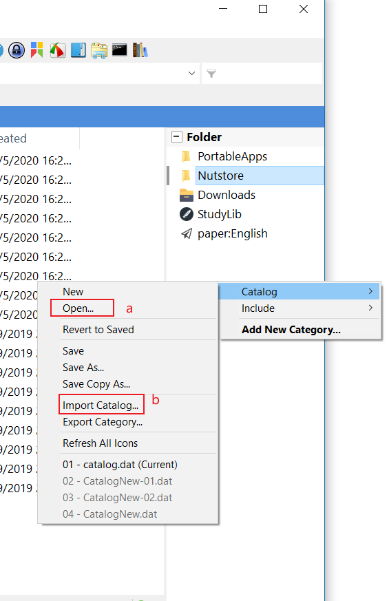

a或b都可用于载入Catalog信息。

-Layout保存和加载

Layout：布局，即，是否显示地址栏，工具栏，Tab栏，状态栏，树，目录等等以及他们的位置摆放信息。

Layout保存和加载通过`Window->Save Layout As... / Load Layout`。

-Tabsets保存和加载

`Tabsets->Save/Save As.../Save Copy As...`

`Tabsets->Open .../Open As...`

-用户自定义命令位于udc.dat,妥善保存。

-用户快捷键位于ks.dat,妥善保存。

## 还原

为了使原版本的数据信息同步到新版本，你可以有几类操作方法：

1.准备一个全新版本XYplorer,然后把旧版本的Data覆盖到新的XYplorer/Data

2.直接在原版本XYplorer菜单栏`Help->Online Support->Check for Updates`进行升级。在21.20.0200以前版本每次升级都不会出现版本到期的现象，不过这一次升级到21.20.0200却出现了版本到期。因此使用方法1稳妥。

-END


# 批量命名 | Rename Special

## 案例1 寻找指定字符串进行替换

需求背景：保证视频文件名(不含后缀)与外挂字幕文件名(不含后缀)一致，Potplayer播放时就会自动载入字幕，为了完成这样的需求，需要改动网上下载到的字幕文件名。

我现有如下文件:

```
F:\Downloads\[VCB-Studio] Shokugeki no Souma][Ma10p_1080p][x265_flac]Subtitles繁体>dir ./b
[VCB-Studio] Shokugeki no Souma [01][Ma10p_1080p][x265_flac].TC-CASO&SumiSora.ass
[VCB-Studio] Shokugeki no Souma [02][Ma10p_1080p][x265_flac].TC-CASO&SumiSora.ass
[VCB-Studio] Shokugeki no Souma [03][Ma10p_1080p][x265_flac].TC-CASO&SumiSora.ass
[VCB-Studio] Shokugeki no Souma [04][Ma10p_1080p][x265_flac].TC-CASO&SumiSora.ass
[VCB-Studio] Shokugeki no Souma [05][Ma10p_1080p][x265_flac].TC-CASO&SumiSora.ass
[VCB-Studio] Shokugeki no Souma [06][Ma10p_1080p][x265_flac].TC-CASO&SumiSora.ass
[VCB-Studio] Shokugeki no Souma [07][Ma10p_1080p][x265_flac].TC-CASO&SumiSora.ass
[VCB-Studio] Shokugeki no Souma [08][Ma10p_1080p][x265_flac].TC-CASO&SumiSora.ass
[VCB-Studio] Shokugeki no Souma [09][Ma10p_1080p][x265_flac].TC-CASO&SumiSora.ass
[VCB-Studio] Shokugeki no Souma [10][Ma10p_1080p][x265_flac].TC-CASO&SumiSora.ass
[VCB-Studio] Shokugeki no Souma [11][Ma10p_1080p][x265_flac].TC-CASO&SumiSora.ass
[VCB-Studio] Shokugeki no Souma [12][Ma10p_1080p][x265_flac].TC-CASO&SumiSora.ass
[VCB-Studio] Shokugeki no Souma [13][Ma10p_1080p][x265_flac].TC-CASO&SumiSora.ass
[VCB-Studio] Shokugeki no Souma [14][Ma10p_1080p][x265_flac].TC-CASO&SumiSora.ass
[VCB-Studio] Shokugeki no Souma [15][Ma10p_1080p][x265_flac].TC-CASO&SumiSora.ass
[VCB-Studio] Shokugeki no Souma [16][Ma10p_1080p][x265_flac].TC-CASO&SumiSora.ass
[VCB-Studio] Shokugeki no Souma [17][Ma10p_1080p][x265_flac].TC-CASO&SumiSora.ass
[VCB-Studio] Shokugeki no Souma [18][Ma10p_1080p][x265_flac].TC-CASO&SumiSora.ass
[VCB-Studio] Shokugeki no Souma [19][Ma10p_1080p][x265_flac].TC-CASO&SumiSora.ass
[VCB-Studio] Shokugeki no Souma [20][Ma10p_1080p][x265_flac].TC-CASO&SumiSora.ass
[VCB-Studio] Shokugeki no Souma [21][Ma10p_1080p][x265_flac].TC-CASO&SumiSora.ass
[VCB-Studio] Shokugeki no Souma [22][Ma10p_1080p][x265_flac].TC-CASO&SumiSora.ass
[VCB-Studio] Shokugeki no Souma [23][Ma10p_1080p][x265_flac].TC-CASO&SumiSora.ass
[VCB-Studio] Shokugeki no Souma [24][Ma10p_1080p][x265_flac].TC-CASO&SumiSora.ass
```

我的替换要求是:

`[VCB-Studio] Shokugeki no Souma [xx][Ma10p_1080p][x265_flac].TC-CASO&SumiSora.ass`替换为`[VCB-Studio] Shokugeki no Souma [xx][Ma10p_1080p][x265_flac].ass`，即`.TC-CASO&SumiSora`需要替换为`""`(即内容为空白，体现在替换内容中就是什么内容都不输入)。

选中所有相关文件，然后菜单栏`File->Rename Special->Search and Replace...`

具体操作如下:


你还可以预览下结果:


语法格式：

```
before/now		//文件中含有的"before"替换为"now"
```

'/'的作用为:  

> define a string to be replaced by another string, both strings separated by '/'.

## 案例2 替换字符串中某个范围的内容

比如有以下文件，需要把`「`和`」`之间的内容去掉，该如何操作

```
问题儿童都来自异世界？ -01 「問題児たちが箱庭にやって来たようですよ？」 BDrip x264-ank.kna.mkv_20201106_184156.071.jpg
问题儿童都来自异世界？ -01 「問題児たちが箱庭にやって来たようですよ？」 BDrip x264-ank.kna.mkv_20201106_184206.959.jpg
问题儿童都来自异世界？ -04 「黒ウサギがエロイヤらしい奴に狙われたようですよ？」 BDrip x264-ank.mkv_20201107_233735.989.jpg
问题儿童都来自异世界？ -04 「黒ウサギがエロイヤらしい奴に狙われたようですよ？」 BDrip x264-ank.mkv_20201107_235627.895.jpg
问题儿童都来自异世界？ -04 「黒ウサギがエロイヤらしい奴に狙われたようですよ？」 BDrip x264-ank.mkv_20201107_235634.839.jpg
问题儿童都来自异世界？ -05 「誓いは星の彼方にだそうですよ？」 BDrip x264-ank.kna.mkv_20201108_164005.740.jpg
问题儿童都来自异世界？ -05 「誓いは星の彼方にだそうですよ？」 BDrip x264-ank.kna.mkv_20201108_220102.628.jpg
问题儿童都来自异世界？ -05 「誓いは星の彼方にだそうですよ？」 BDrip x264-ank.kna.mkv_20201108_220119.796.jpg
问题儿童都来自异世界？ -05 「誓いは星の彼方にだそうですよ？」 BDrip x264-ank.kna.mkv_20201108_220122.821.jpg
问题儿童都来自异世界？ -06 「問題児たちがお祭り騒ぎに参加するようですよ？」 BDrip x264-ank.kna.mkv_20201108_220533.452.jpg
问题儿童都来自异世界？ -06 「問題児たちがお祭り騒ぎに参加するようですよ？」 BDrip x264-ank.kna.mkv_20201108_220540.260.jpg
问题儿童都来自异世界？ -06 「問題児たちがお祭り騒ぎに参加するようですよ？」 BDrip x264-ank.kna.mkv_20201108_220544.739.jpg
问题儿童都来自异世界？ -06 「問題児たちがお祭り騒ぎに参加するようですよ？」 BDrip x264-ank.kna.mkv_20201108_220550.478.jpg
```

需要用到`File->Rename Special->RegExp Rename...`的功能。

两种语法格式如下: 

```
RegExpPattern > ReplaceWith     (case-insensitive: a=A)
RegExpPattern > ReplaceWith\    (case-sensitive)
```

特别注意: <span style="color:red">**`>`前后都需要补一个空格**</span>，否则不管匹配的正则表达式是正确的，也会出错。

可以先去[正则表达式在线测试 | 菜鸟工具](http://c.runoob.com/front-end/854)测试下匹配结果：

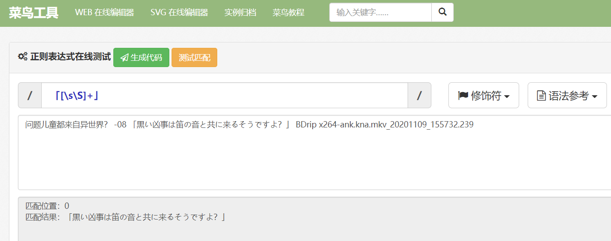

接着，我们进行使用`RegExp Rename...`进行替换:

```
「[\s\S]+」 > 
// \s是匹配所有空白符，包括换行，\S是匹配非空白符，包括换行。
// [\s\S]匹配所有,但只匹配一个满足条件的字符
// +是限定符，用于指定它前面的表达式的匹配次数
// [\s\S]+表示多次匹配所有字符,匹配多个满足条件的字符
//「[\s\S]+」匹配以'「'开头和'」'结尾以及它们之间的所有字符
```

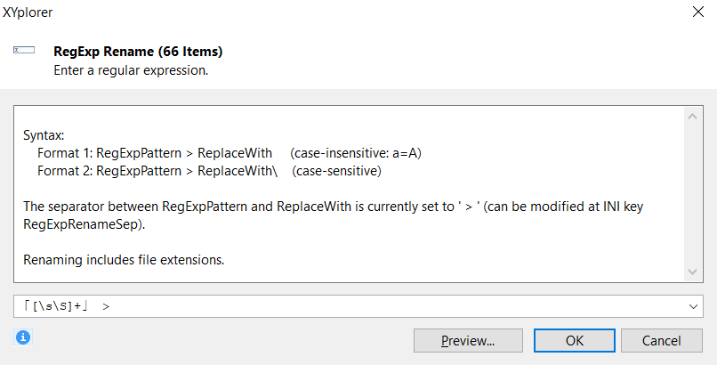

预览结果：

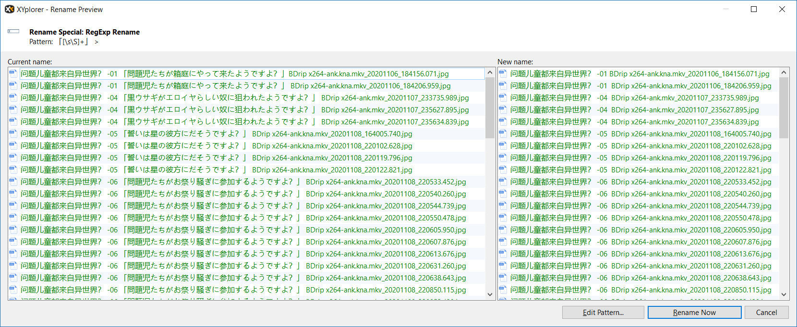

成功完成替换：


在BDrip前面加上-：

```
\s+BDrip > -BDrip
```

结果如下：


案例结束。

你可以参考[菜单教程的正则表达式](https://www.runoob.com/regexp/regexp-tutorial.html)部分进行学习，并且该网站也提供了[正则表达式在线测试工具](http://c.runoob.com/front-end/854)。

正则表达式重命名(`RegExp Rename...`)是一项很强大的功能，它相较于`Search and Replace...`，有更高的灵活性，可以定制搜索内容的类型和范围，但也提高了使用成本。

此外，XYplorer使用的是`VB5 regex engine`。

> XY uses the VB5 regex engine.[[?](https://www.xyplorer.com/xyfc/viewtopic.php?t=5357)]


