# 前言

布局篇介绍布局元素的使用，通过下面三张图片，我们来了解下XYplorer有哪些布局元素：

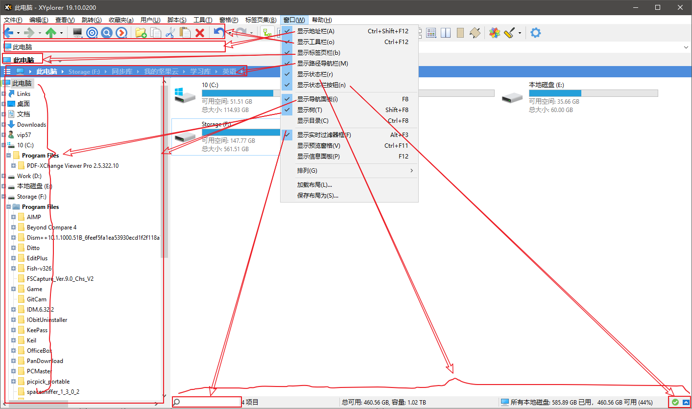

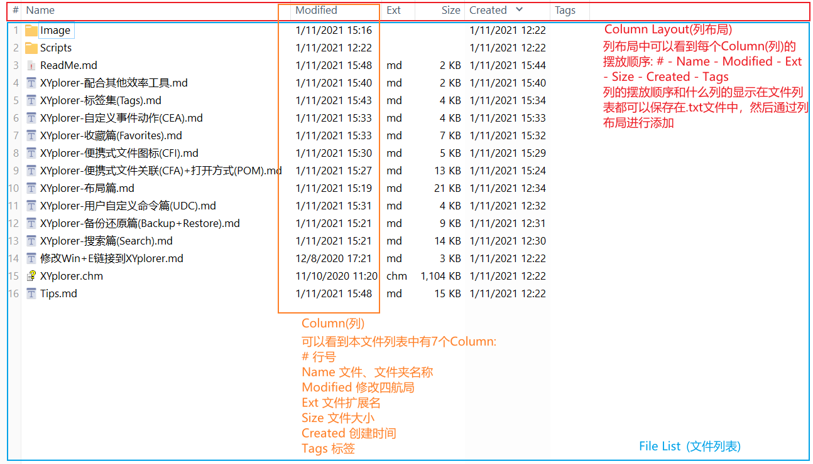

在自定义动作事件(CEA)中，我看到"Folder List"出现过，在功能使用上，我认为它指的是"File List"(就目前而言)。

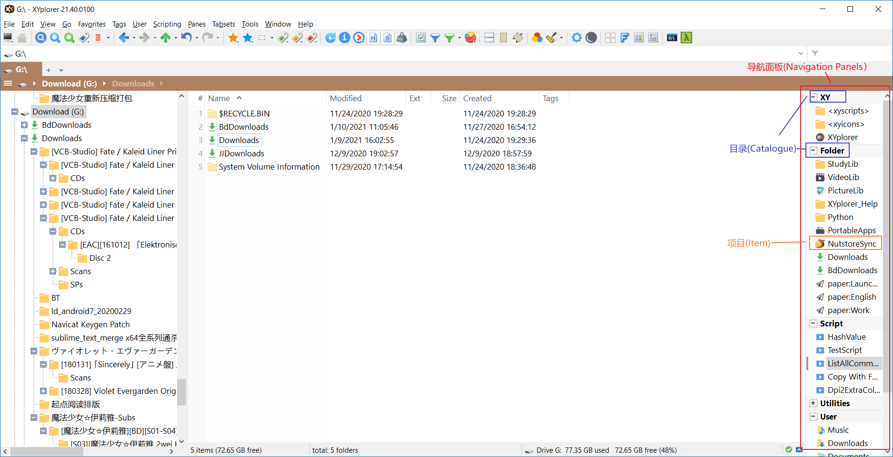


# PART1 导航面板之目录 | Navigation Panels - Catalog

## 1.打开导航面板-目录

F8->Ctrl+F8即可打开。


## 2.添加目录

Catalog栏是空白的，需要右键`Add New Category...`


自定义名称


确认右边栏就会变成这样


## 3.添加项目

### 3.1拖动式添加项目

如果你需要添加文件到目录上，那么就把文件拖到“你需要的名称”上。

比如我把一张图片(Catalog-4.png)拖到目录名上，就会出现如下内容，


### 3.2自定义式添加项目

#### 添加脚本

**选中目录名称**，然后右键`Add New Item Here...`(快捷键式<kbd>Insert</kbd>)，可以自定义你要添加的项目。比如刚刚添加的.png文件就是一个项目(Item)。

若我想要添加一个脚本呢？

以下脚本的功能是选中一个文件，然后鼠标左键轻点一下就会复制文件的路径，不过这个文件的路径是以正斜杆`/`分割路径部分的。比如，`D:/Work/GitWorks/XYplorer_Help/Updates/Image/Catalog-5.png`，而不是`D:\Work\GitWorks\XYplorer_Help\Updates\Image\Catalog-5.png`。这么做是为了避免要在字符串中转义反斜杠`\`。

脚本内容如下，


Caption: `Copy Path With Forward-slash to Clipboard `

Location:

```
::if(<curitem>==""){copytext replace(<curpath>, "\", "/");} else{copytext replace(<curitem>, "\", "/");}
```

#### 添加纸文件夹

-先创建纸文件夹

从地址栏输入<code>\<xypaper\></code>，回车进入纸文件夹XYplorer\Data\Paper。

创建纸文件夹，纸文件夹以.txt结尾。我这里创建名为Test.txt。

-添加纸文件夹到目录

打开纸文件夹的语法格式:`paper:纸文件夹名`


-添加项目到纸文件夹


-请尽情探索纸文件夹

如果你打开\<xypaper\>/Test.txt，可以发现多处一行内容：

```
D:\Work\GitWorks\XYplorer_Help\Updates\Image\Catalog-8.png
```

纸文件夹不仅可以保存文件，还可以保存文件夹，纸文件夹主要用于存放同一个主题的素材。

## 4.目录数据的保存

-定位当前目录的数据文件


-数据文件保存位置

地址栏输入<code>\<xycatalogs\></code>回车即可看到目录数据文件。丢失数据文件，那么目录栏就是空白的了，请保存好。


# PART2 定制文件列表 | Customize List

以下内容讲解都是在视图方式为“详细”(Details)的情况下进行的，操作如下图所示:(菜单栏/工具栏进行视图设置，二选一)

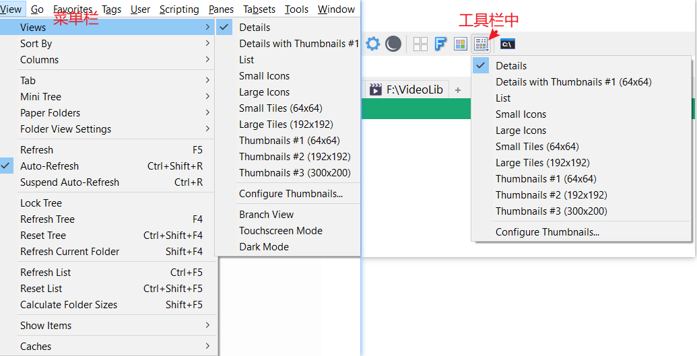

在菜单栏中可以找到，如下图所示：


这是我为列表设置的参数，几个打钩的选项都是常用的。

`Rename On Slow Double-Click`:推荐。双击可进行文件命名。注意，双击每次点击的时间间隔长一点。

`Highlight Selected Row`：选项勾选后，其背景颜色由如下图决定：

设置->Colors and Styles->Colors->Selected Rows


`Full Row Select`:不推荐，选中一个文件后，那么整行都被选择，鼠标在整行范围内双击都是打开文件。而使用`Highlight Selected Rows`后，高亮背景色范围内双击是返回上一级路径。

`Autosize Columns`:推荐，该选项可以让文件列表的所有列信息显示完整，也就是每个列都进行最大有效范围的拉伸。

`Show Folder Size`:不推荐。因为开启后每次浏览需要读取文件夹大小。如果文件夹大小过大，会让加载速度变慢。

加载速度有效改善的方法：

设置->Tree and List->List->Cache folder sizes


该选项可以加快浏览文件列表的速度，但是无法保证第一次计算的文件夹大小的准确性。再次计算文件夹大小可保证目标文件夹的有效性，操作如下图所示：

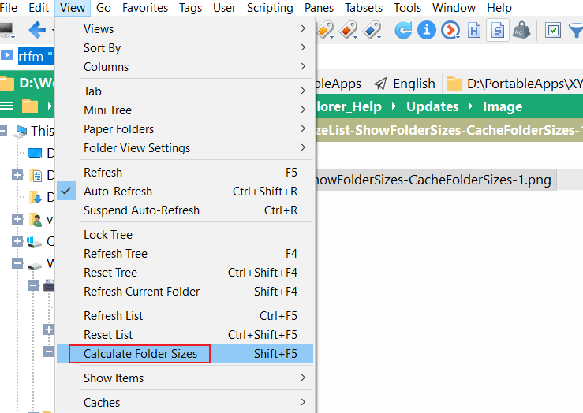

关于`Cache folder sizes`的作用详细说明，请在地址栏输入：

```
rtfm "idh_settings.htm#idh_foldersizecaching";
```


# PART3 自定义列 | Custom Column

## 1.基本术语

### 1.1什么是Column Layout?


所以文件统称为项目(Item)。

XY界面的布局是什么意思？布局就是各种组件的位置摆放以及是否摆放。组件有状态栏，树，目录，自定义列等等。

每个文件夹中所有items都有自己的列，这个列表取决于你如何设置Column Layout的参数。

### 1.2什么是Column, Custom Column, Extra Column?


## 2.设置列布局 | Column Layout

### 添加列的方法

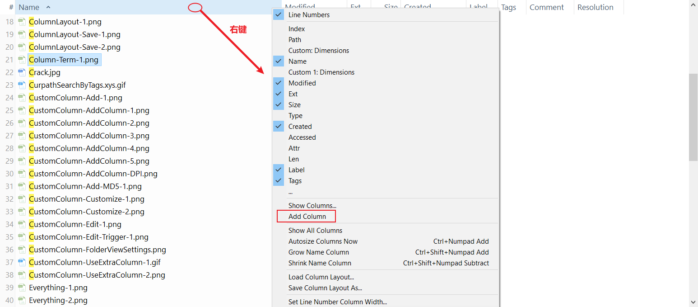

### 列属性的类型

一个列中可以载入三种类型的属性：Property, Special Property, Custom Column


对于Custom Column可以配置它的载入属性还多出了三种：Script, Template, Mixed:

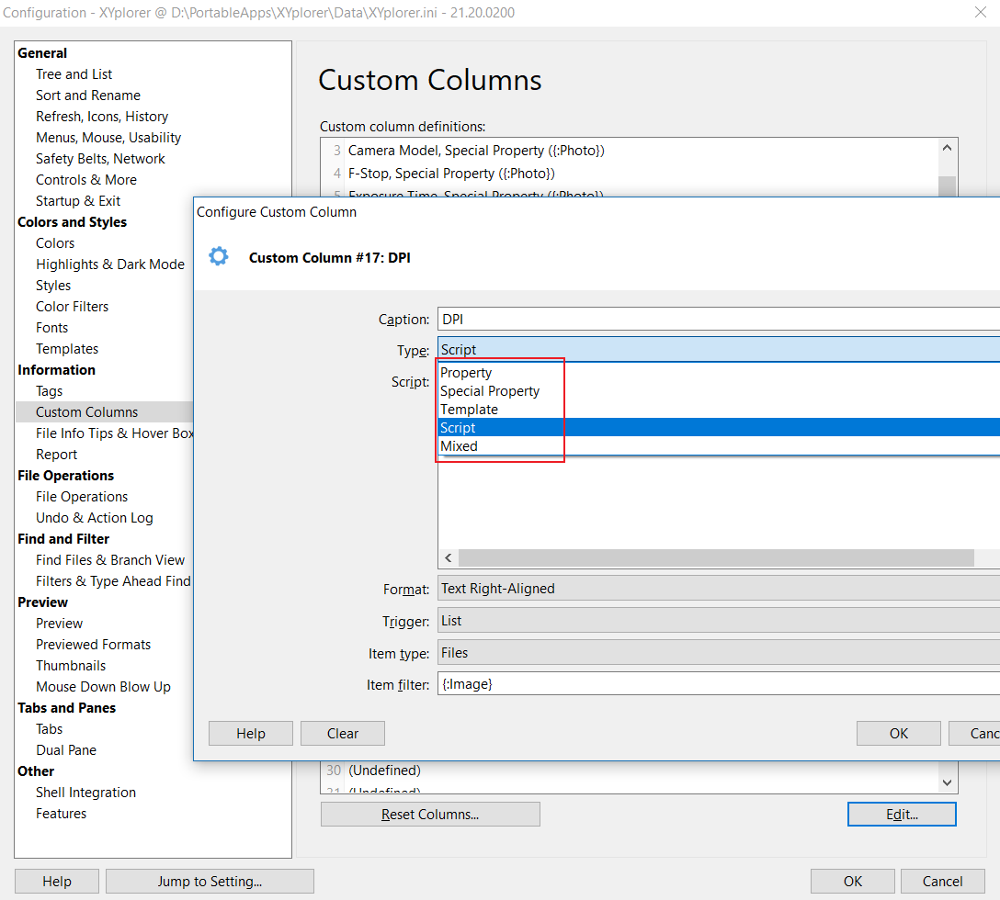


### 定制属性列 | Property

#### [案例1]添加文件属性项列

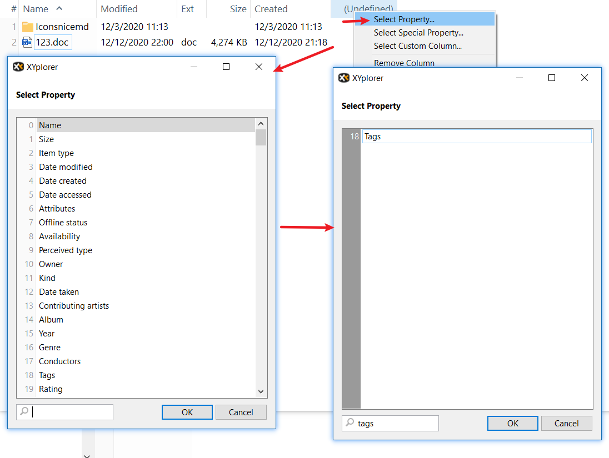

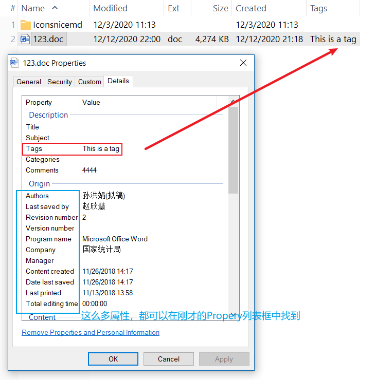

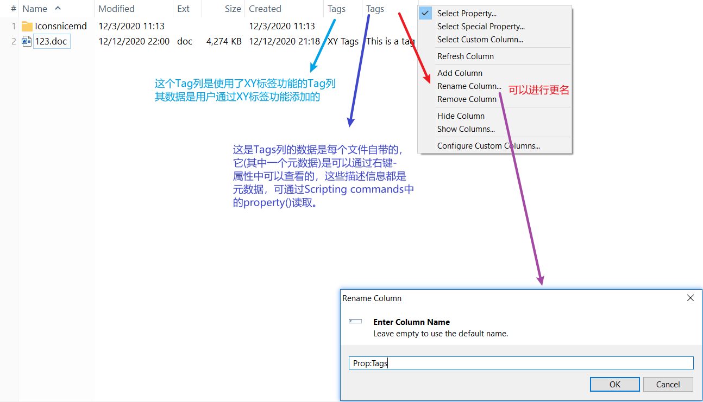

### 定制自定义列

参考[Overview of custom column snippets / scripts - XYplorer Beta Club](https://www.xyplorer.com/xyfc/viewtopic.php?f=7&t=18653)


#### [案例1]Image size in inches

1. 地址栏输入`::snippet`

2. 在提示框中输入

   ```
   Snip: CustomColumn 1
     XYplorer 18.90.0000, 22.03.2018 12:28:38
   Action
     ConfigureColumn
   Caption
     Size (inches)
   Type
     3
   Definition
         $dpi = get("Screen", "dpi");
         $hSize = property('System.Image.HorizontalSize', <cc_item>);
         $vSize = property('System.Image.VerticalSize', <cc_item>);
         if (!$hSize || !$vSize) { return "<unknown size>"; }
         return round(($hSize / $dpi), 2) . " x " . round(($vSize / $dpi), 2);
   Format
     1
   Trigger
     1
   Item Type
     0
   Item Filter
     {:Image}
   
   ```

3. 这样就添加了名为Size (inches)的自定义列了，效果图如下

   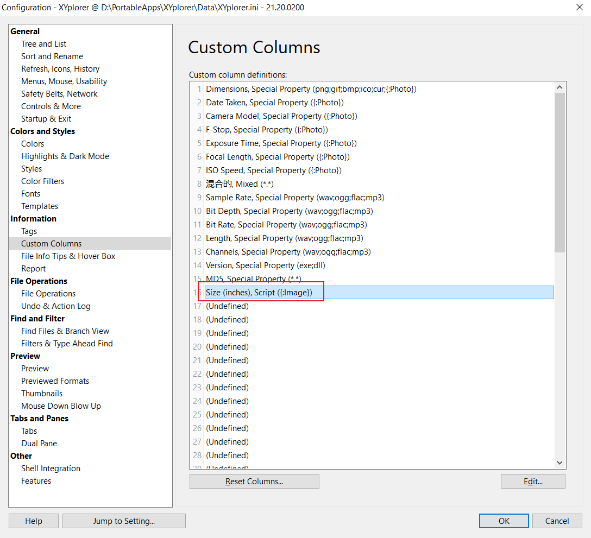

   

4. 添加自定义列

   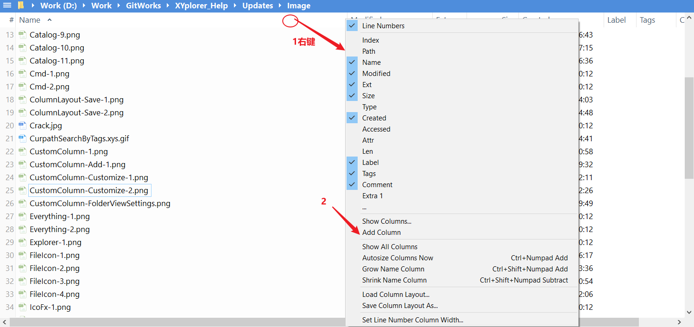

   

   

   

   这样就添加好了。

   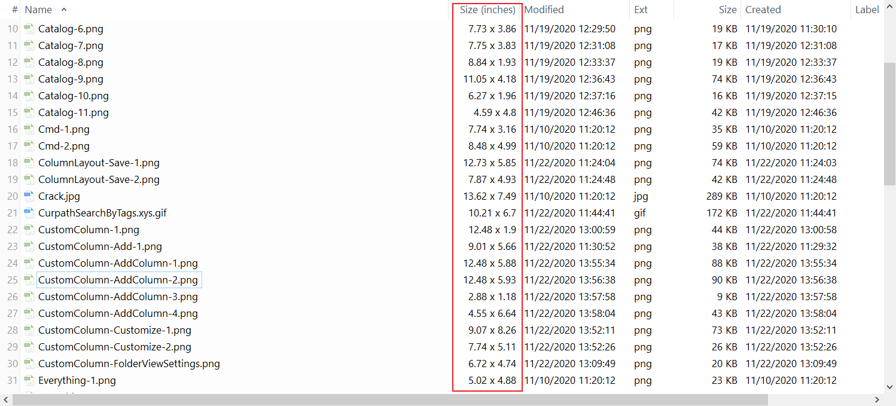

   

#### [案例2]Resolution

地址栏输入`::snippet`，在提示框中输入如下内容

```
Snip: CustomColumn 1
  XYplorer 18.90.0000, 22.03.2018 12:28:38
Action
  ConfigureColumn
Caption
  DPI
Type
  3
Definition
      $hSize = property('System.Image.HorizontalSize', <cc_item>);
      $vSize = property('System.Image.VerticalSize', <cc_item>);
      if (!$hSize || !$vSize) { return "<unknown size>"; }
      return $hSize." x " .$vSize;
Format
  1
Trigger
  1
Item Type
  0
Item Filter
  {:Image}

```

按照[Image size in inches]的方法添加DPI列到列布局中。


## 3.文件数量过多时Column加载卡顿的解决方法

文件数量过多会卡，这是XY应该背的锅吗，我认为责任应该对半分，因为这些文件要使用Shell Properties读取属性，然后将这些属性显示到Custom Column中，那么从软件层次考虑，速度取决于读取属性的速度(Windows侧)和载入到Custom Column(XY侧)的速度，XY侧再深入点讲，也要考虑到使用Script中涉及遍历的情况。可能会有人说，干吗不用到缓存技术，其实我也在想为什么不用到缓存技术呢，并不是XY没有使用到这一技术，只不过XY没有运用缓存技术到部分Custom Column上。因此，许多自定义列会卡的原因就在这里，也就是你打开文件夹，XY就开始扫描并载入属性到文件列这个过程卡，这取决你的文件数量。当然，我们可以利用Extra Tag进行模拟缓存（在下面会讲到），也或者改变载入自定义列的触发方式。

### 方法一:改变载入Custom Column的触发方式

-进入Custom Column配置界面。有两种方法

方法一。如下图所示，


方法二。F9呼出设置界面，按如下图所示进行操作，


主要改变的是Trigger参数，这里有三个，各有优缺点，其中List和Click都可以避免大量文件时的卡顿。

关于Click的运用场景就是：

添加一个关键字包含"MD5"的Custom Column，而不是Column，然后配置其触发方式为Click，然后再需要使用的时候点击MD5对应的Custom Column，读取MD5

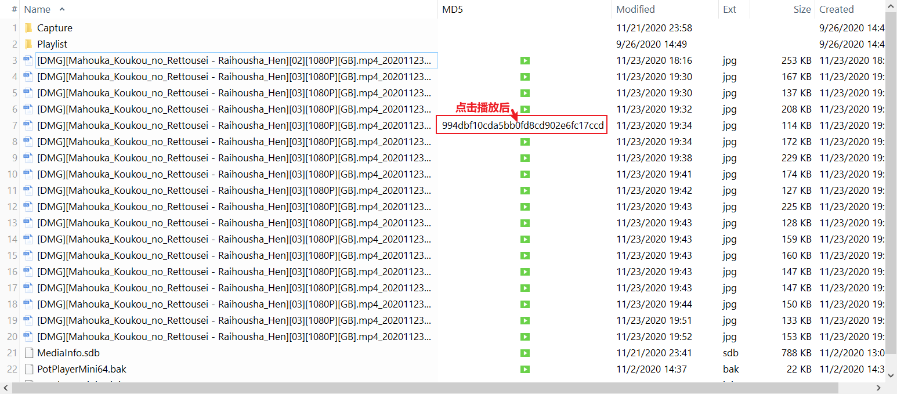

Trigger参数介绍

地址栏输入：

```c
rtfm "idh_customcolumns.htm";		//进入后，找到Trigger黑体字标题部分
```

可找到对应的英文解释，在这里给出：

> Trigger
>
> Here you can select at which point the  script or process that generates the cell data is actually triggered. You have  three choices:
>
> - **Browse** [Default]: Column is triggered when the list is filled with  folder contents or search results.
> - **List**:  Column is triggered when the items are listed. Only the currently visible items  are processed. This option will be much faster than "Browse" on long lists, but  the scrolling will be not as smooth.
> - **Click**: Column is triggered when the symbol that is shown as a  placeholder is clicked (actually you can click anywhere in the cell). Maximum  speed, also when scrolling. All data are only shown on demand.
>
> Notes:
>
> - When you right-click a column header and select Refresh  Column then the whole column data will be generated/refreshed.
> - Columns of type "Mixed" inherit the trigger per-cell from  the chosen sub-column.
> - When Custom Columns of type Script are triggered by Click  and the script has no "return" command then the click symbol remains in the list  and can be clicked again and again.

### 利用Extra Column手动模拟缓存

下面模拟对所有文件列表加载DPI属性，效果如下，


这样做的好处是所有文件列需要DPI的属性都导入到Extra Column1中了，这样持久化的数据就避免了大量使用Shell Properties加载。

该脚本的功能是扫描当前文件夹的图片，若有子文件是不会去遍历的。该脚本一旦开始，无法结束，也就是你只能等待脚本执行结束，否则选择强制结束进程。这不是意味着脚本使XY卡住了，而是大量IO读写，能处理多快与磁盘性能有关，若扫描的文件处于磁盘坏道或扇区上，会造成卡死。

如果你一个文件夹有上万个图片，老实说我也不知道执行得有多慢。

```
	sel 1;
	while (<curitem> != "") {
		// msg <curitem>;
		$dims = property("#image.dimensions", <cc_item>);
		$width = gettoken($dims, 1, " x ");
		$height = gettoken($dims, 2, " x ");
		tag $width." x ".$height, <curitem>, "ex1";
		sel + 1;
	}
```

脚本已经贴出。

添加到目录栏的方法是添加一个项目<kbd>Insert</kbd>到目录，其中Location填写如下内容

```
::load <xyscripts>."\名称.xys";	//脚本文件请放在XY/Data/Scripts文件夹
```

使用这个脚本的缺点就是会增加tag.dat，随着tag.dat大小越来越多，我也不知道会不会让XY运行时出现什么莫名其妙的BUG。隐藏需要维护tag.dat数据文件，关于清理数据文件可参考：

[Folder size caching - XYplorer Beta Club](https://www.xyplorer.com/xyfc/viewtopic.php?f=5&t=11375)

使用过程可能存在的疑问：[100MB limit in tag.dat? - XYplorer Beta Club](https://www.xyplorer.com/xyfc/viewtopic.php?t=19289)


Extra Column的命名通过以下方式实现，


#### 参考

video folder with special custom columns opens slow - XYplorer Beta Club
https://www.xyplorer.com/xyfc/viewtopic.php?t=18715

Slow Loading of Large Folders - XYplorer Beta Club
https://www.xyplorer.com/xyfc/viewtopic.php?t=19296

Folders with a lot of files charge very slow - XYplorer Beta Club
https://www.xyplorer.com/xyfc/viewtopic.php?f=3&t=19090&p=160050#p160050

地址栏输入可阅读涉及主题的参考：

```c
rtfm "idh_customcolumns.htm#idh_ccscriptedcolumns";		// Scripted Columns
rtfm "idh_scripting_comref.htm#idh_sc_property";		// property()
rtfm "idh_variables.htm";		// XYplorer Native Variables
http://msdn.microsoft.com/en-us/library/windows/desktop/dd561977%28v=vs.85%29.aspx		// the locale-independent Windows canonical properties
```


## 保存和加载Column Layout

为了定制自定义列用于显示不同类型的文件，比如视频文件的自定义列有播放时间，分辨率，Codecs等等；音频文件需要的自定义列有Codecs，播放时间，Sample Rate等等；图片文件需要自定义列有DPI，Album，照相机类型，拍摄时间等等。由此定制自定义列显得必要，我们需要保存自定义列，在需要的时候进行加载。

-保存Column Layout


Column Layout的文件命名应该符合以下的格式，才会清晰便于确定列的顺序：

```
第1列名-第2列名-...-第N列明.txt
```


-加载Column Layout

在自定义列空白处右键->Load Column Layout...->选择想要的列布局。


## 自定义列布局应用到特定文件夹

假设你有StudyLib, PictureLib, Pothole, VideoLib这几个文件夹，分别装着同类的文件。如果你想让每个文件夹及其子文件都按需显示不同的自定义列，那么你就需要分别对StudyLib, PictureLib, Pothole, VideoLib的文件夹视图设置中勾选`Cloumn layout`，并且勾选`Include subfolders`：

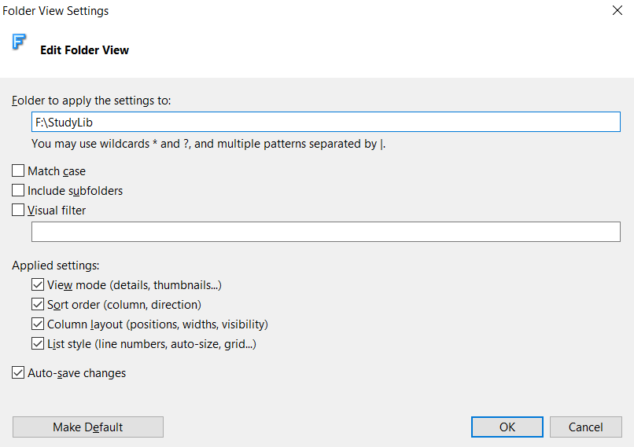

`Folder to apply the settings to`的匹配规则：

```c
F:\StudyLib	//匹配在F盘的StudyLib文件夹
*\Images*	//匹配所有名为Images(不区分大小写)的文件夹
*\Images*|*\Pics*	//匹配所有名为Images(不区分大小写)和Pics(不区分大小写)的文件夹
```

`Match case`: 勾选后，匹配时会区分文件大小写，比如\*\\Images\*不会匹配名为images的文件夹。

这个地方我没法讲台细，等我用到就会补上一个具体案例，如果要讲解我会新起一个一级标题来讲"文件夹视图设置"。


# PART4 树的使用 | Tree

树的配置主要在`View`、`Tools->Customize Tree`、`Configuration(F9)->Tree and List`，少部分可以通过键入关键字"Tree"到`Configuration(F9)->左下角Jump to Setting`进行寻找、

菜单栏`Windows->Show Tree(Shift + F8)`，打开Tree记录功能。

`View->Mini Tree`：只显示选项卡(Tab)的路径的树，由于不需要显示无关目录的树，所以速度更快。

由于Tree会记录文件浏览历史，在退出XYplorer前，`View->Reset Tree(Ctrl + Shift + F4)`，如果路径历史过多，影响加载速度。

在Tree开启的情况下，每一次浏览目录，侧边的Tree都会追踪记录，所以你可以很容易看到当前目录和历史目录的层次结构。

`Tools->Customize Tree->Tree Path Tracking`：开启树追踪标记


`View->Lock Tree`：开启后，记住（冻结为）上一次树结构的状态，接下来无论怎样浏览目录，树的追踪记录都看不到。开启期间，应该是不会有目录追踪记录的。当关闭后，恢复树的追踪记录功能，并更新为当前目录的树结构。使用建议：需要树功能，XYplorer运行卡的情况下可锁定。

我的使用方法：关闭Mini Tree，Reset Tree，Lock Tree。把Tree的侧边栏空间压缩，只保留很小的地方，如图

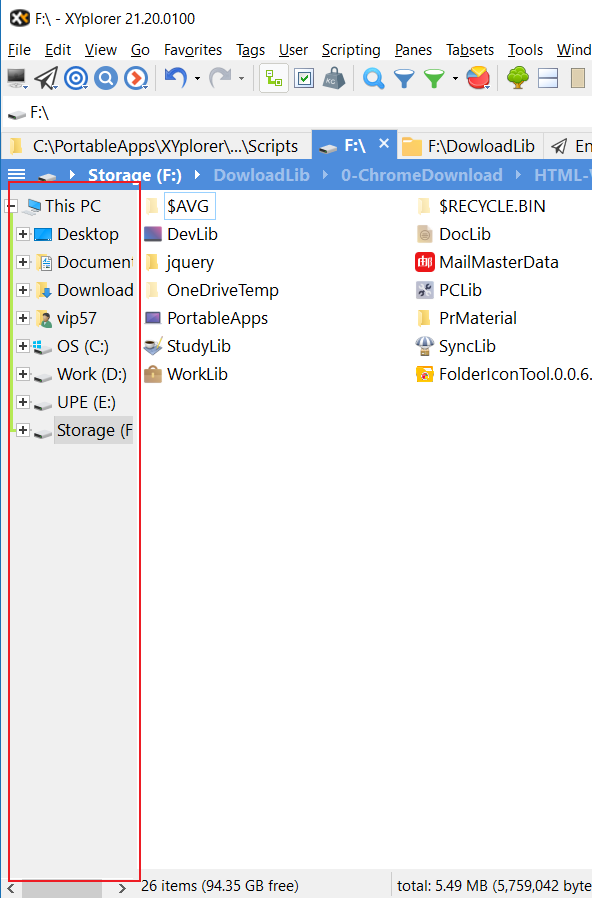

之所以这样做，是因为我需要快速浏览C/D/E/F，对显示树结构的目录需求不是很大，并且在Tree侧边栏**右键**可以弹出**收藏夹列表**。

如果你需要使用树的功能，请一定要把XYplorer界面左右两侧拉长，如果不拉长，使用起来很没有体验。两侧拉长还有一个重要的理由：但你的文件夹视图是“详情视图”时，每一个文件的描述列：文件名、修改时间、创建时间、后缀名、文件夹大小等，想要把这些列的信息全，那么你就必须拉长。


# PART5 工具栏的使用 | Toolbar

## 工具栏的摆放和使用

一个合理的工具栏按钮摆放，可以提高使用效率。这是我的工具栏按钮摆放(2020/11/10)：


我的电脑 | 前、后退、上一级、撤销等 | 收藏、添加Tags | 文件属性、打开方式、是否显示系统文件，隐藏文件 |  Visual过滤 | Pane | Color过滤器 | 设置 夜间模式 | View功能 | 用户按钮


## <span id="further_use_of_button">按钮的高级用法</span>

### <span id="explorer_button">[案例1]使用Windows文件管理器打开XYplorer当前路径</span>

-使用效果如下，

-具体方法如下，

1.提取图标。提取工具[IcoFX3(下载地址若失效，自行下载)](https://ghpym.lanzous.com/b00zelckd)[可选]


2.添加按钮


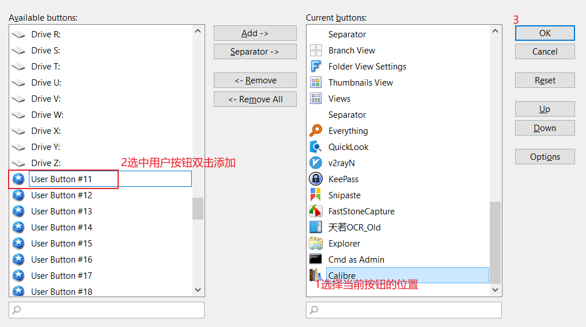


内容信息如下

``` 
Explorer
<xyicons>\Explorer.ico
run "C:\Windows\explorer.exe" <curpath>
```

这个脚本不完善，仅限打开当前目录。需要功能更全的Explorer脚本，可以使用[XYplorer-用户自定义命令篇(UDC)](./XYplorer-用户自定义命令篇(UDC).md)中的[设置快捷键调用Explorer]部分的脚本。

`<xyicons>`介绍请参考[XYplorer-脚本篇(Scripting)](./XYplorer-脚本篇(Scripting).md)。

### [案例2]CMD集成到按钮

XY官网已经把**Cmd的按钮集成到工具栏了**，并且提供了热键<kbd>Ctrl + Alt + P</kbd>。

你现在可以在自定义工具栏中的列表中找到它，


不过下面我还是给出用户自定义Cmd按钮的方法。


按钮信息如下，

```
Cmd as Admin
<xyicons>\Cmd.ico

$comspec = ("%osbitness%" == 64) ? "%windir%\System32\cmd.exe" : "%windir%\SysWOW64\cmd.exe";
    $cscript = ("%osbitness%" == 64) ? "%windir%\System32\cscript.exe" : "%windir%\SysWOW64\cscript.exe";

    $vbsFile = "%TEMP%\~OpenElevatedCMD.vbs";

    $vbsContent = <<<>>>
        Set UAC = CreateObject("Shell.Application")
        UAC.ShellExecute "$comspec", "/k pushd ""<curpath>""", "", "runas", 1
>>>;

    writefile($vbsFile, trim($vbsContent));

    if (get("trigger") == "1") { // Left click -> Admin
        run """$cscript"" ""$vbsFile"" //nologo", , 0, 0;
    } elseif (get("trigger") == "2") { // Right click -> No admin
        run """$comspec"" /k pushd ""<curpath>""";
    }
```

按钮的添加方法在“按钮的高级用法”[[?](#further_use_of_button)]部分有讲到。

使用评价：

这个cmd其实也不是很好用，也没有快捷键可以调用按钮，再加上XY官网已经集成了Cmd按钮。下面还是会给出一些替代方案。

Alternative Solution 1(比较笨(～￣(OO)￣)ブ):  偶尔我还是会<kbd>Win + R</kbd>来启动cmd，进入cmd，切换盘符（比如<code>f:</code><kbd>Enter</kbd>)，然后在XYplorer某个目录下<kbd>Alt + D</kbd> <kbd>Ctrl + C</kbd>复制路径回到cmd粘贴。

Alternative Solution 2(我未测试过): 你也可以先把cmd集成到Windows右键的Context中，然后[将windows右键菜单添加到XYplorer](https://zhuanlan.zhihu.com/p/70331585)，XYplorer中使用Windows右键ContextMenu调用cmd。我不想折腾了，要命了。

Alternative Solution 3(推荐): 你完全可以使用XYplorer集成的Windows文件管理器按钮打开Explorer.exe[[?](#explorer_button)]，使用Windows自带的文件管理器空白处右键运行cmd[[?](https://www.cnblogs.com/dream4567/p/10693588.html)]。

