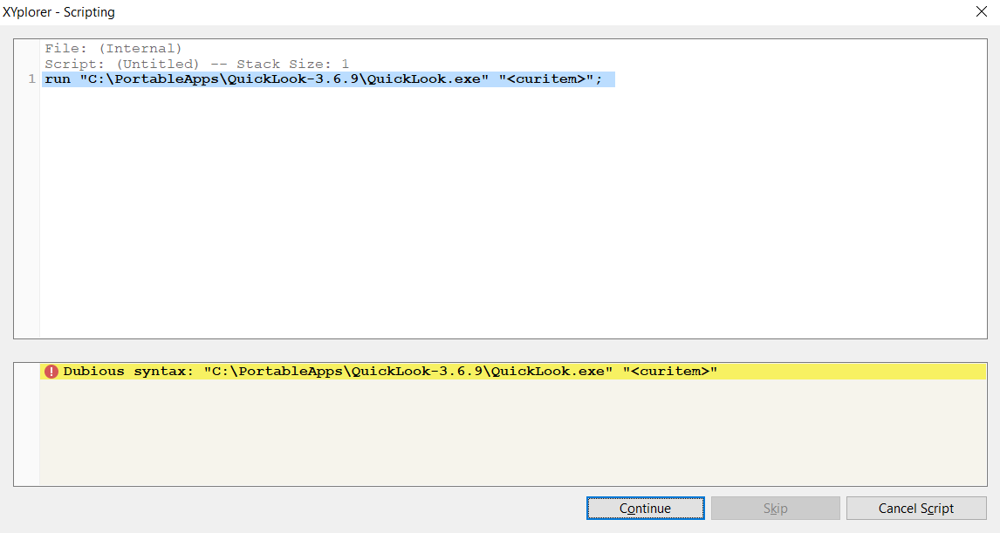

# 按钮和用户自定义命令区别

工具栏上的都是按钮，这些按钮中，用户自定义的按钮(`User Button`)都是没办法分配快捷键的。

如果需要使用快捷键关联什么操作，那就需要使用用户自定义命令(User-Defined Commands)。

> Buttons are meant for the mouse. UDCs are meant for the keys.[[?](https://www.xyplorer.com/xyfc/viewtopic.php?t=14505)]


# <span id="user-defined_commands">用户自定义命令的使用 | User-Defined Commands</span>

## 设置快捷键调用Notepad

### Notepad

创建`OpenWithNotepad.xys`存放在XYplorer/Data/Scripts目录下，内容如下，

```
	// 当前选中项目不为空
	end <curitem> == "";
	// 当前选中项目不是文件夹
	if (filetype(<curitem>) != "Nofile") {
		run notepad "<curitem>";
	}
```

添加命令方法：`User->Manage Commands...->Category:Load Script File->New-Add New Command`填写Caption和Script File

`Assign Keyboard Shortcut... `，我设置的<kbd>Alt + 3</kbd>。


```
Caption:Open With Notepad
Scripts Files:<xyscripts>\OpenWithNotepad.xys
```

使用方法：选中文件，<kbd>Alt + 3</kbd>速度调用`notepad`打开文本。

### Sublime Text

脚本文件名为OpenWithSublimeText.xys存放在Scripts目录下了。

### Notepad2

脚本文件名为OpenWithNotepad2.xys存放在Scripts目录下了。

## <span id="explorer_ks">设置快捷键调用Explorer</span>

设置方法同上，创建`OpenWithExplorer.xys`存放在XYplorer/Data/Scripts目录下，内容如下，

```
	if (<curitem> == "") {
		run "C:\Windows\explorer.exe" <curpath>
	} else {
		if (filetype(<curitem>) == "Nofile") {	//选中的是目录
		run "C:\Windows\explorer.exe" <curitem>
	}
		else {	
			run "C:\Windows\explorer.exe" <curpath>
		}
	}
```

我分配的快捷键是<kbd>Ctrl + Alt + E</kbd>

```
Caption:Open With Explorer
Scripts Files:<xyscripts>\OpenWithExplorer.xys
```


## <span id="xy_quickLook">在XYplorer中使用QuickLook</span>

[QuickLook](https://github.com/QL-Win/QuickLook)  [(此处下载)](https://github.com/QL-Win/QuickLook/releases)

-具体方法如下，

1.在`你的XYplorer目录\Data\Scripts`下在创建一个`.xys`脚本文件，命名为`Run QuickLook.xys`，内容如下

```
run "你的QuickLook目录\QuickLook.exe" "<curitem>";
```

2.然后，按下图完成设置，


我这里分配的按键<kbd>Alt+1</kbd>

Script File内容如下

```
<xyscripts>\Run QuickLook.xys
```

3.最后，请关闭语法检查，具体方法如下，


若未关闭语法检查，使用QuickLook配合快捷键会出现这样的错误，



4.方法介绍完了，使用时，先选中要预览的文件，然后<kbd>Alt+1</kbd>即可。

-说明事项：

XYplorer中使用QuickLook，是否可以使用空格键？

答：QuickLook在XYplorer使用中，不能使用<kbd>Spacebar</kbd>，因为它是被XYplorer保留[[?](https://www.xyplorer.com/xyfc/viewtopic.php?t=20326)]，因而你无法在XYplorer中使用它。

参考：https://github.com/QL-Win/QuickLook/issues/96


