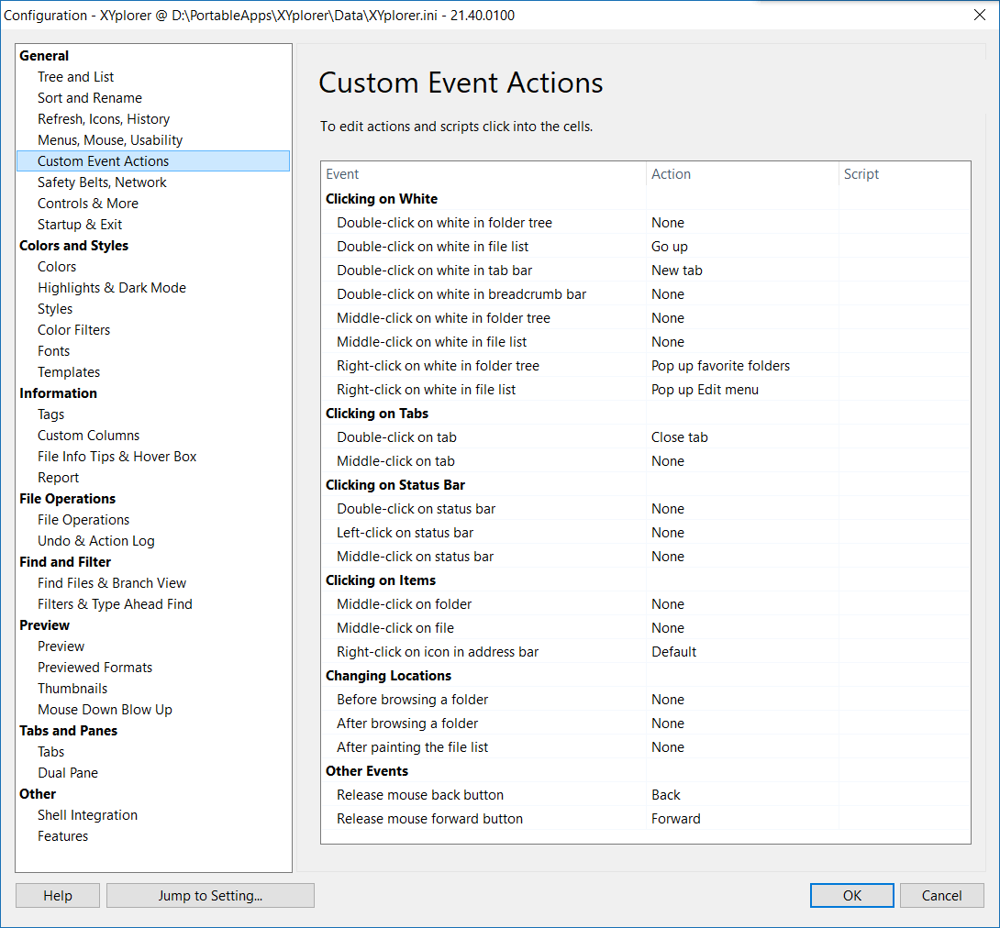
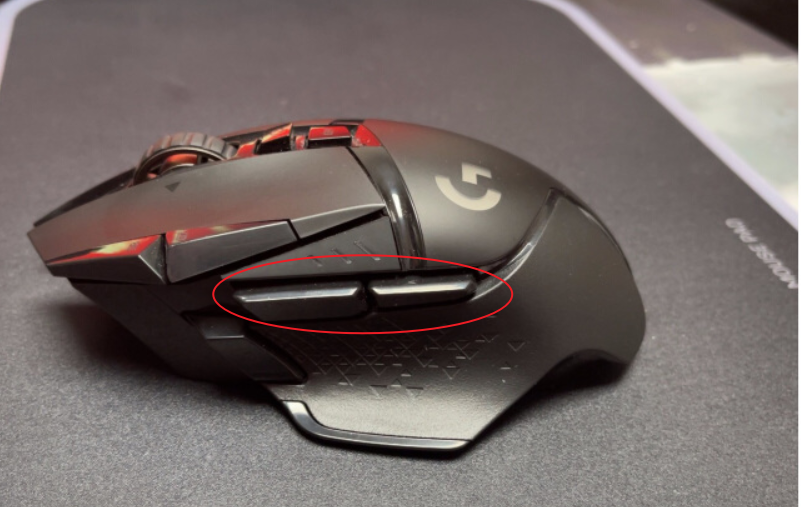

# 自定义事件动作 | Custom Event Actions(CEA)

这是XY 21.40.0100加入的新特性。该特性在配置->General->Custom Event Actions中。如下图所示



可以看到大部分事件都是与鼠标动作有关，如左键双击，滚轮(中键)双击等等。

关于鼠标双击空白处怎么没办法返回上一级的解决方法：在上图的"Clicking on White"中找到"Double-click on white in file list"，选择Actions为"Go up"就可解决该问题。

什么是"mouse back button"和"mouse forward button"：



一般来说，很普通的鼠标只有鼠标左中右键，是没有鼠标前进后退键，这些鼠标宏按键在游戏鼠标中很常见。上图鼠标红圈就是宏按键，我一般都将这两个按键设置为前进和后退功能。

以下为我的CEA使用建议:

| Event                                   | Action                  | Script          | Description                                                  |
| --------------------------------------- | ----------------------- | --------------- | ------------------------------------------------------------ |
| Double-click on white in file list      | Go up                   |                 | 双击文件列表空白处可以返回上一级目录                         |
| Double-click on white in tab bar        | New tab                 |                 | 双击tab bar可以新建标签页                                    |
| Double-click on white in breadcrumb bar | Run Script              | goto %computer% | 双击breadcrumb bar空白处可以返回"我的电脑"(更多环境变量的信息可以在地址栏输入`::#728;`) |
| Right-click on white in folder tree     | Pop up favorite folders |                 | 右键树空白处可以弹出收藏文件夹                               |
| Right-click on white in folder list     | Pop up Edit menu        |                 | 右键文件列表空白处可以打开编辑菜单(我也不知道folder list和file list的区别,但是在文件列表空白处你也是可以右键打开编辑菜单的) |
| Double-click on tab                     | Close tab               |                 | 双击标签页关闭标签(这与某国内浏览器标签页关闭手势一致啊)     |
| Double-click on status bar              | Toggle info panel       |                 | 双击状态栏可以弹出信息面板(由于我把信息面板设置在底部所以双击可方便打开,这样你可以不用使用<kbd>F12</kbd>呼出该面板了) |
| Release mouse back button               | Back                    |                 | 对于有宏按键的鼠标来说，按下后退键就是在历史路径中选择上一个路径进行后退 |
| Release mouse forward button            | Forward                 |                 | 对于有宏按键的鼠标来说，按下前进键就是在历史路径中选择下一个路径进行后退(若下一个路径不存在,什么也不会发生) |

帮助文档：地址栏输入

```
::rtfm "idh_settings.htm#idh_settings_cea";
```


